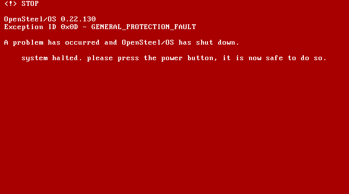

# What OpenSteel/OS does in a crash

System crashes are serious. They range from the Microsoft Windows bugcheck/stop error (more well known as the infamous Blue Screen of Death) and kernel panic equipped by Linux, macOS and the Unix family to things like the Xbox 360's Red Ring of Death. As such, it is important that there is a way for OpenSteel/OS to handle a crash.

___

## Brief Overview

The idea for a crash handler was first toyed with in OpenSteel/OS 0.22 Build 37 in July 2025. A function, `panic()`, was added and crudely defined in the kernel and, if invoked, would (a) spit out an error message, and then (b) enter a `while(1)` loop in an attempt to stomp on the brakes. It was never invoked in this forme. The current design was implemented in OpenSteel/OS 0.22 Build 130 in November 2025, following an incident when developing the CMOS driver leading to an unhandled general protection fault.

 - *Function Name:* `void panic(uint32_t errorId)`
 - *Introduced:* 0.22.130 (2025-11-21)

## Output

The result produced from this function being invoked clears the screen, changes the colours to `0x4F` (white text on red background), and provides an error header. We can dissect this to be as such:

 - `<!> STOP` is the error header, indicating the severity of the error.
 - `OpenSteel/OS 0.22.130` is the version header, with `OpenSteel/OS` hardcoded in to the error and `0.22.130` being handled with `%d`.
 - `0x0D` is the **Exception ID**. In this case, 0x0D is the exception for a general protection fault, an x86 error which may relate to memory or priveleged instruction.
 - `GENERAL_PROTECTION_FAULT` is the exception's text ID. This is to provide a deciphered and human-readable error code, like in Microsoft Windows. There are 22 text IDs, although the number of exceptions is up to 31. If the exception ID (handled by `uint32_t errorId`) is a larger number than the array of text IDs, it will report `UNKNOWN_EXCEPTION`. It'd be too long to list all of their names, but among this list is `DIVIDE_BY_ZERO` (this should normally be caught by your compiler, but in case it doesn't, Intel made an exception for that), `NON_MASKABLE_INTERRUPT`, `INVALID_OPCODE`, and `PAGE_FAULT`. There are also some exceptions you will likely never see, such as `COPROCESSOR_OVERRUN`.

When the message saying `system halted.` appears, the assembly functions `cli` and `hlt` are run, and it should be safe to power off the machine (whether in VirtualBox or physical hardware). Also, take note of the boolean `inStateOfPanic`. This has a lot of power over this function's first phase. It is normally set to `false` by default, but if it is already set to `true` before `panic(uint32_t errorId)` is called, when `panic(uint32_t errorId)` is called, the bugcheck screen will not be displayed, and OpenSteel/OS will go directly to running `cli` and `hlt`. An example of this behaviour would be visible in OpenSteel/OS 0.22 Build 147 when trying to run the `ver` command, if it weren't for the fact that Nathan forgot to make a copy of its ISO before compiling 0.22 Build 148. Oh well. Just call `GrabSysVer(f)` in `printf()` and you'll see what I mean.

The design of this error screen was influenced by the bugcheck screen from Microsoft Windows NT 3.1 thru 6.1 (Windows 7), which, as previously stated, is a blue screen. I opted for the colour red, because (1) the colour blue is already being used by the normal UI, and (2) red is, in my eyes, a colour which better suits the serious nature of errors. I don't care if you call it the "Red Screen of Death", since in the end, the goal is to ensure this screen shows up as little as possible. And I haven't seen instances of exceptions being spat about much in my own testing, so I've succeeded so far.

## One Exception to `panic()`

There is one exception/error in which `panic()` can't and probably shouldn't be invoked for: the triple fault. This error has affected OpenSteel/OS builds before, and usually will cause a PC to reboot. In the case of VirtualBox, it invokes the Guru meditation error and immediately halts the virtual machine.